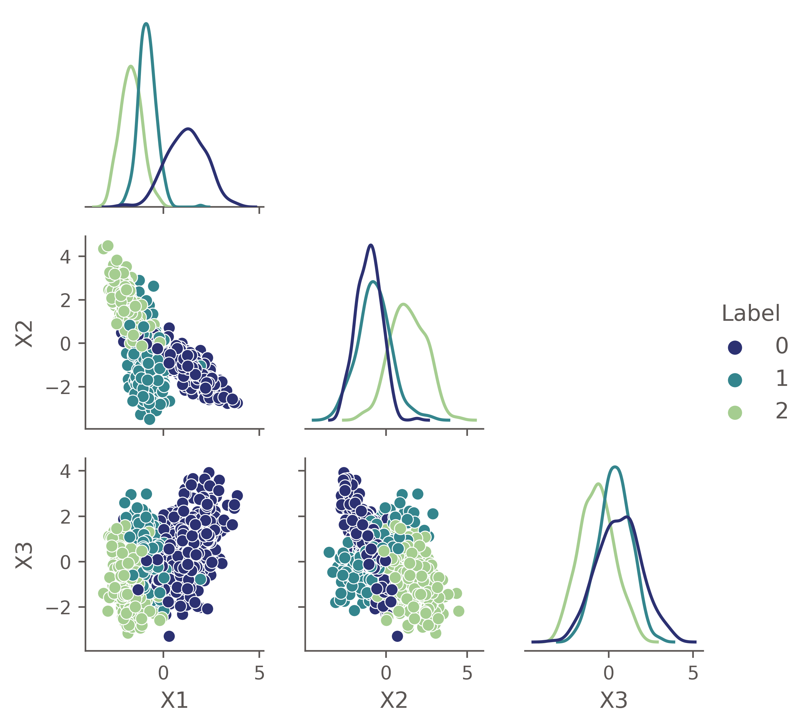
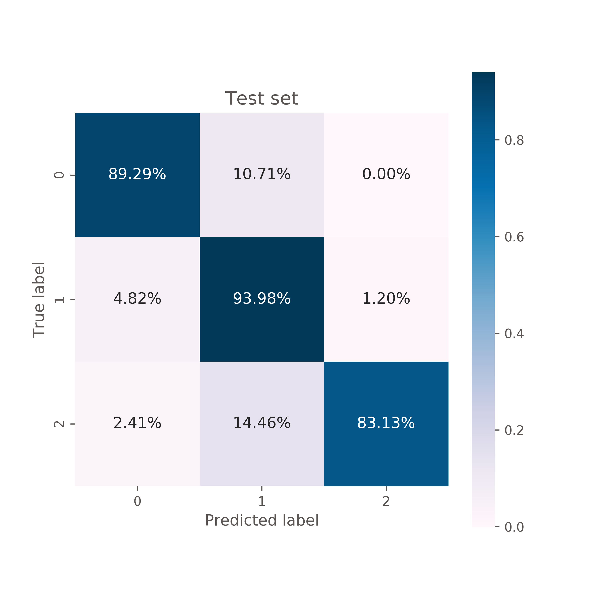

# Introducing class imbalance

## Learning goals and implementation
In this section, we will increase the complexity of multi-class classification by introducing class imbalance. 
Students will learn why accuracy alone is insufficient to evaluate the performance of a classifier, and will become familiar with
other metrics (specifically precision, recall, and F1). 

This will be a combination of a mini lecture, a mini lab, and a discussion.

---

### Mini lecture

As a primer for dealing with and understanding class imbalance, we have to introduce model evaluation metrics beyond simply accuracy. We can do this using a very simple dataset, generated with `make_classification` in `sklearn`:
```python
# create dataset
X_balanced, y_balanced = make_classification(n_classes=3, weights=None, n_samples=1000, 
                                             n_features=3, n_redundant=0, n_informative=3,
                                             n_clusters_per_class=1, class_sep=2, 
                                             random_state=0, flip_y=0.01, hypercube=False)
```

As we can see in the pair grid below, we have reasonable separation between classes and we should be able to proceed with classification:



For this particular dataset, we can train a logistic regression classifier, and the accuracy that we get on the test set is 88.8%. However, we have multiple classes and this doesn't tell us very much! A confusion matrix is more illuminating:



Now we can see that the classifier does pretty well and *most* samples are classified correctly across all classes. Let's define a few more metrics to make this clearer:

#### Recall
For a given class, this is the fraction of true class members that were correctly identified, or:
```
recall = (True Positives) / (True Positives + False Negatives)
```


#### Precision
For a given predicted label, this is the fraction that are correct, or:
```
precision = (True Positives) / (True Positives + False Positives)
```

#### F1 (F-beta)
The F1 score is an average of precision and recall. Its generalized version, F-beta, allows the user to specify which parameter (recall vs precision) is more important, and gives that one heavier weight.

Ask students if they can think of any real-world cases where recall might be more important than precision, and vice versa!

#### combining scores
These scores can be computed for individual classes. But if we want a summary score for the model as a whole, we have to choose how to combine the information. Generally the final score will be an average, but we have options:
* `macro`: each class gets equal weight, meaning you compute a score within an individual class and then average across classes.
* `micro`: each sample gets equal weight, so you do not split by class. Note this ends up giving greater weight to larger classes.

For this particular dataset, the combined scores are:
* Recall: 88.7%
* Precision: 89.9%
* F1: 88.9%

(in this case they are the same for macro and micro because our classes are balanced -- but we need to introduce the concept before the students start on the lab!)

---

### Mini lab

The following notebook is meant to guide the students through multi-class classification with class imbalance:

`./ipynb/class_imbalance_instructor.ipynb`

#### DATA
In this part of the lesson we'll build our own datasets using `sklearn`'s `make_classification`. This is a very useful function that will allow students
to easily explore the effects of various dataset properties on the problem of class imbalance (they can change the dataset size, number of features and classes, 
usefulness of features, distinctness of classes, how noisy the class assignments are, how imbalanced the data are, etc etc). Playing around with the different
settings and creating a variety of increasingly complex datasets will help solidify the issue of class imbalance and also serve as a hopefully-smooth transition 
to the real-world dataset that they'll use in the next part of the lesson.

#### Flow of the lab
The first two sections - building and modeling balanced vs imbalanced datasets - are meant to be completed relatively quickly. The goal is mainly to set up a direct comparison between the types of datasets, and to provide some coding snippets that will be useful. To this end, most of the code has been provided and the students should spend more time thinking/discussing than coding.

The final section is the main one, where students will build their own imbalanced datasets and explore the many ways in which things can become more complicated. This will involve more coding on their part, but they can copy/paste relevant lines as needed from the previous sections.

---

### Wrap-up discussion
1. As classes become *more* imbalanced, describe how the challenge of modeling a dataset evolves 
(i.e., does increasing class imbalance make things more or less difficult?)
2. What about as the classes become more similar (in feature space)? Does the size of the dataset matter? What about the relevance of the features?
3. Aside from various optimization choices, what else do you think could be done? 

**Note to instructors:** The last question is meant to lead into a (brief) discussion of techniques to upsample smaller classes or downsample larger classes. Recommendation is to just mention various options and students can look into these on their own time.

**Extra resources:**  
* Evaluation metrics: students can read about [precision-recall curves](https://scikit-learn.org/stable/modules/generated/sklearn.metrics.precision_recall_curve.html) or [ROC curves and AUC scores](https://scikit-learn.org/stable/modules/generated/sklearn.metrics.roc_curve.html)
* Dealing with class imbalance: [imblearn](https://imbalanced-learn.org/stable/) is a very useful package that integrates nicely with `sklearn` and provides a variety of resampling options, including e.g. (SMOTE)[https://imbalanced-learn.org/stable/over_sampling.html#from-random-over-sampling-to-smote-and-adasyn] upsampling.
